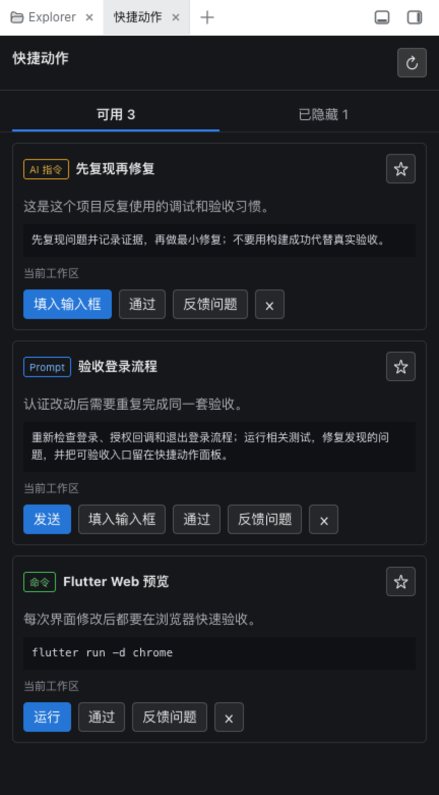

# DSH Dev Actions

**Let the AI turn repeated development operations into one-click actions beside the conversation.**

[中文](README.md) | [Install](#one-minute-install) | [Contributing](CONTRIBUTING.md)

[](https://github.com/deepseek-ai/deepseek-harness)
[](https://github.com/topics/dsh-plugin)
[](https://github.com/skitse/dsh-dev-actions/releases)
[](https://github.com/skitse/dsh-dev-actions/actions/workflows/ci.yml)
[](LICENSE)

AI-assisted development still leaves small, repetitive chores to the user: finding a Flutter device ID again, restarting the same dev server, retyping an acceptance prompt, or reminding the model to reproduce a bug before fixing it.

`dsh-dev-actions` notices those patterns while the model works and maintains a compact action panel for them. You do not curate a launcher or ask the model to “make this a button.” The model discovers and updates the useful entries; you decide when to click.

<p align="center">
  
</p>

## What it actually does

| Repeated operation noticed by the AI | Saved as | What a click does |
| --- | --- | --- |
| `flutter run -d chrome`, a dev server, focused tests, log commands | **Command** | Runs in the bound workspace with visible logs and Stop support |
| “Re-check login, OAuth callback, and logout” | **Prompt** | Queues an explicit new user turn for the current agent |
| “Reproduce first; do not treat a successful build as acceptance” | **AI instruction** | Inserts editable text into the composer for review |

This is not a manually managed command palette. It is **AI-maintained operational memory for the human-in-the-loop development cycle**.

The model may discover, update, deduplicate, and retire entries. It cannot execute or send one merely by creating it; every consequential action remains an explicit user click.

## Two-minute install

Requires Node.js 22.19+ (or 24+). If you normally start DSH only with `npx @deepseek-ai/dsh web`, first install the DSH CLI and the pnpm executable its plugin manager uses:

```sh
npm install --global @deepseek-ai/dsh@0.1.0-rc.6 pnpm@10.32.1
```

Then install the plugin:

```sh
dsh plugin --profile web add dsh-better-sidebar@^0.10.3 \
  https://github.com/skitse/dsh-dev-actions/releases/latest/download/dsh-dev-actions.tgz
```

Restart `dsh web`, refresh the browser, and select **Dev Actions / 快捷动作** from Better Sidebar's new-tab menu.

Source development also requires Node.js 22.19+ and pnpm 10:

```sh
git clone https://github.com/skitse/dsh-dev-actions.git
cd dsh-dev-actions
pnpm install
pnpm build
dsh plugin --profile web add dsh-better-sidebar@^0.10.3 link:"$(pwd)"
```

DeepSeek Harness is currently a developer preview. This plugin pins the DSH RC range it supports.

## How proactive maintenance works

The plugin registers persistent model guidance and four fixed tools. When the model sees a genuinely reusable operation, it calls `dev_action_upsert`. Stable keys update existing actions rather than filling the panel with duplicates.

Actions may be workspace-wide or session-only. Users can pin, hide, restore, run, stop, approve, and report problems. Explicit feedback wakes the current agent so it can read the result and continue. The optional `dev-actions-maintainer` Skill performs a full library audit; ordinary proactive discovery does not require the user to invoke it.

## Where it helps

- **Flutter, iOS, Android:** remember device and launch parameters;
- **Web:** start dev servers, run E2E checks, repeat acceptance prompts;
- **Backend and containers:** run focused tests, service commands, and log views;
- **Xcode and native projects:** preserve project-specific build and simulator commands;
- **Any AI workflow:** retain recurring review criteria and collaboration instructions.

## Safety and control

- Exact action content and rationale are visible before use.
- Content revisions are bound to a digest; stale clicks are rejected.
- Commands run only in the authoritative workspace bound to the DSH Session.
- Execution uses DSH's managed Shell and Session sandbox policy, including credential scrubbing and process-tree lifecycle.
- Instructions default to editable draft insertion.
- The model supplies validated action data, never new privileged executors.

## Build it with us

Real workflows from other developers are the point of this project. Contributions are especially welcome for Flutter device discovery, dev-server URL detection, Xcode and Android adapters, parameterized actions, templates and sharing, risk UX, accessibility, localization, and a generic action interop contract for other DSH plugins.

Start with a [`good first issue`](https://github.com/skitse/dsh-dev-actions/labels/good%20first%20issue), a [`help wanted`](https://github.com/skitse/dsh-dev-actions/labels/help%20wanted) item, submit a concrete [workflow proposal](https://github.com/skitse/dsh-dev-actions/issues/new?template=workflow.yml), or share an early idea in the [real-workflow discussion](https://github.com/skitse/dsh-dev-actions/discussions/4). See [CONTRIBUTING.md](CONTRIBUTING.md) for architecture and validation.

## Scope

This plugin makes repeated operations one click away. It is not a remote IDE and does not provide remote access, device streaming, or arbitrary GUI automation. Dedicated plugins may provide those capabilities and interoperate with Dev Actions later.
